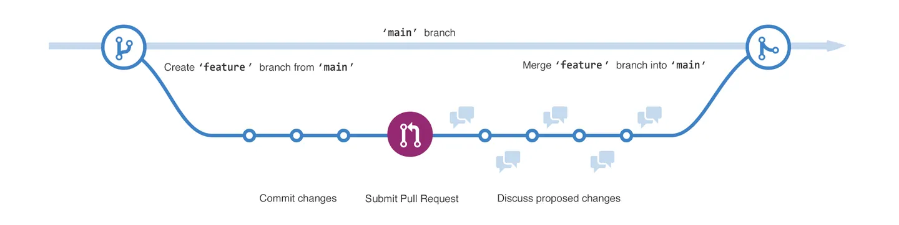

# Intro to Git

## What is Git?

Git is a distributed version control system, meaning:

- **Distributed**: We have and work on local copies of the [repo](#repo) (the shared folder).
- **Version control system**: Keeps track of changes (i.e. takes a snapshot of) of files **only**.

## Why is it the best?

1. **You are in control** of _what_ and _when_ to take a snapshot (conversely to e.g. Google Drive that saves on any change).
2. It's **local-first** and therefore **fast** and **offline**.
3. It's (plain) text-based and therefore **scalable** and **portable**.

> **Note**: Most of the commands are available in VS Code in the form of UI (buttons, menus, etc). However, knowing how to run them in the terminal will make you be on top of how you manipulate the repos you contribute to.

## Basics of Git

### Download and install

1. To check if you already have Git installed, open a terminal and run `git --version`.
2. If you get a number, you are good to go! Otherwise, [download and install Git](https://git-scm.org/downloads).

### Repo

Git lives in repos, i.e. folders of projects (`.git/`). It saves information on what file(s) changed, when and by whom.

To **create a repo**:

- Locally: `cd` into a directory and run `git init`.
- Remotely (on GitHub):
  - Go to [https://github.com/new](https://github.com/new).
  - Once created, `cd` into the **parent** folder where you want to download the repo and run `git clone https://github.com/<username>/<repo>`.
  - `cd <repo>` to enter in the repo.

This is **your local copy** of the repo. You are free to make changes. To learn how, see the following sections.

To see the status of your repo, namely whether you have [modified or untracked files](#staging-and-committing), run `git status`.

To see a summary of the changes in the repo, run `git log` or `git log --oneline` to get concise logs.

### Branches

In Git (and GitHub), there's always the `main` branch (default name now &ndash; used to be called `master`), which is the most up-to-date and production-ready version of your code.



Sometimes, we may need to work on a feature separately from `main` so we don't obstruct the progress of other team members. In other words, we would like to _branch off_ `main` and create a "parallel universe" in Git. When we are ready to update `main` with our changes, we `merge` our branch onto `main`, usually through a [pull request](#pull-requests).

To **create a branch**:

1. Ensure you have the latest version of `main` by running `git pull`.
2. Run `git checkout -b <new-branch-name>` to create and switch to it directly.
Now, every new commit you make won't affect the `main` branch.

If you need to switch from one branch to another, run `git checkout <branch-name>`, and your current branch will now be `<branch-name>`.

> **Note:** You cannot checkout to another branch if you have [staged changes](#staging-and-committing)!

## The Git Workflow

When you make changes on any file in VS Code, you will see its filename:

- Followed by **U** (= **Untracked**), i.e. that Git doesn't track changes happening in this file.
- Followed by **M** (= **Modified**), i.e. that the version you have open in front of you differs from Git's last snapshot.
- **Grayed out**, meaning that Git is explicitly not allowed to track this file (see `.gitignore`).

### Fetching and Pulling

When others commit code and push it to GitHub, you will need to update your local repo with the latest version **before you start making changes**.

> **Important:** If you start making changes to pieces of code that other people have modified in the meantime, next time you push to GitHub, you will be greeted by a **merge conflict**!

To update your local copy of the repo to its latest version, run `git pull`. This will:

- Fetch the latest changes.
- Apply them onto all the branches.

> If you only need to see what the latest version looks like but not incorporate them onto your local copy, run `git fetch` instead.
> **You need to run **`**git pull**`** every time you are planning to make changes to the code!**

### Staging and Committing

To save changes to Git (called `commit`), you need to:

1. **Add** the file **to Staging** (`git add <filename>` or `git add -u`). You will now see an **A** (= **Added**) next to the files that were staged in VS Code.
2. **Commit the changes** by including a short yet **descriptive message** (`git commit -m "message here"`).

### Pushing

Great! Now, in order for others to be able to synchronize your changes with their local repos, you need to "upload" them to the remote repo on GitHub:

1. Run `git push origin HEAD`.
2. (Optional) create a [pull request](#pull-requests) if needed.

A few clarifications:

- `origin`: the name of the remote (conventional – almost never changes).
- `HEAD`: the position of Git on your local repo (i.e. where Git is pointing as current position in the "timeline"). You could, instead, write the name of your current branch but `HEAD` is automatically replaced by the branch you are currently on. [Learn more about branches](#branches).

## Pull Requests

A pull request is the way one can propose changes to the `main` branch of a repo. It allows you to:

- **Test** the changes in a separate environment. See [GitHub Actions](./intro-to-github.md#actions).
- **Track** the changes in a structured way. See [GitHub Projects](./intro-to-github.md#projects).
- **Review** and **discuss** the changes using comments. See [GitHub Discussions](./intro-to-github.md#discussions).
- **Merge** the changes onto `main` once they are ready so that they become part of the production code.

To create a pull request from your local branch to `main`:

1. Push your branch to GitHub with `git push origin <your-branch-name>` or `git push origin HEAD` (if you are on the branch you want to push).
2. You will get a link in the terminal to create a pull request. Click on it.
3. Fill in the details of the pull request and click on "Create pull request". You can also assign reviewers and labels to the pull request.
   > **Pro tip**: Make sure you have a clear and concise title and description, and that you check the diff (scroll down on the webpage) to make sure you are not including any unintended changes.

## Git Cheat sheet

Here, (almost all) the most used Git commands are listed. It can be cumbersome to remember or go through all of them. Feel free to reach out to me if help is needed (rather than fixing it after the fact).

They are divided into two groups:

- **Actions** (commands that do something).
- **Checks** (command that print information).

### Actions

Initialize a local repo in the current directory:

```sh
git init
```

Clone a remote repo locally under `<repo-name>/`:

```sh
git clone <repo-url>
```

Stage changes:

```sh
git add .   # all modified AND untracked files
git add -u  # ONLY modified files
```

Un-stage (= revert without losing) changes:

```sh
git reset --soft <filename>  # if not <filename>, all modifications are reverted
```

Revert and LOSE your local changes:

```sh
git reset --hard <filename>  # if not <filename>, all modifications are lost
```

Show the changes between files:

```sh
git diff  # displays the diff per modified file
git diff --cached  # in case you have already staged the files

git diff --word-diff  # instead of per character
```

> **Pro tip**: You can use `git diff` between any two files by running `git diff --no-index <modified> <original>`!

Commit changes:

```sh
git commit -m "Your message here"  # conventionally, we use present tense (e.g. "Update README" instead of "Updated README")
```

> **Pro tip**: If you want to add more information, you can do `git commit -m "Short commit message" -m "Long description of what changed"`.

Make a change to your last commit (either add extra files or change the commit message):

```sh
git add <forgotten-file>  # if you forgot to commit a file
git commit --amend --no-edit  # will keep the last commit message
git commit --amend -m "Updated commit message here"
```

> If you need to make a change to **any previous commit** other the latest one, hit me up and we will find a way to do it without messing with the history too much :)

Push commits to remote repo (GitHub):

```sh
git push origin HEAD  # can be git push origin <current-branch>
```

Switch branches:

```sh
git checkout <existing-branch>
git checkout -b <new-branch>  # create <new-branch> before switching
```

### Checks

Check current repo status:

```sh
git status
```

Check the history (logs):

```sh
git log
git log --oneline  # for more concise output
```

get a detailed view of a specific commit:

```sh
git show HEAD  # latest current commit
git show <commit-SHA>
```

List local branches (a * is placed before the current branch):

```sh
git branch -a
```

List remote repo(s) URL:

```sh
git remote -v
```
